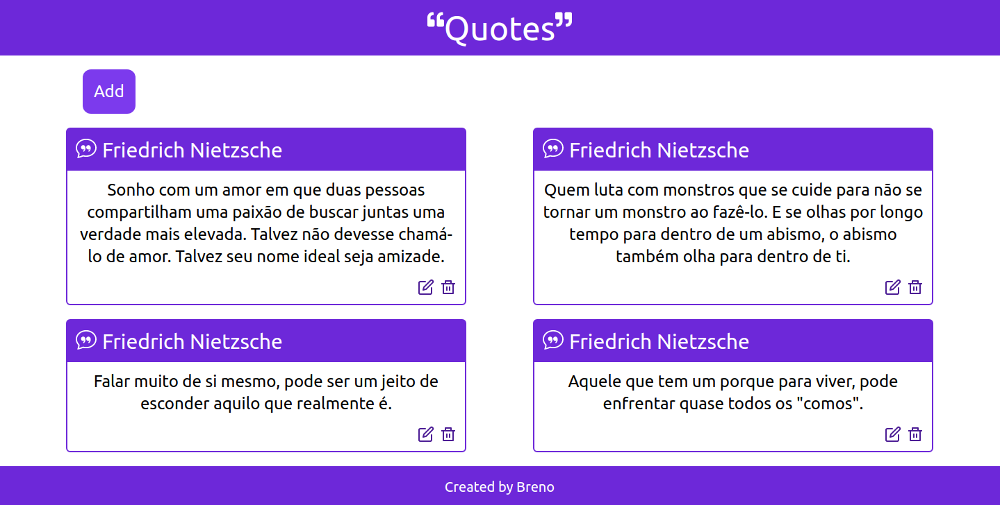
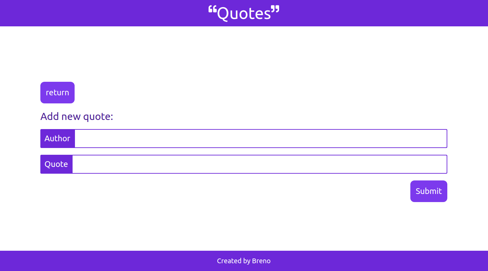
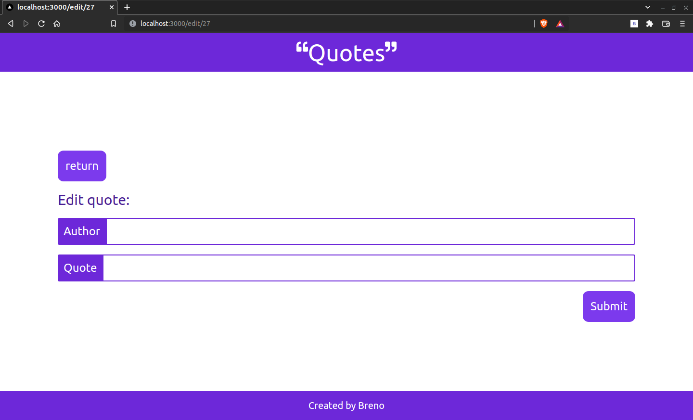

# Quotes

## 👀 Como ficou ???

</img>
----------
</img>
----------
</img>
----------

## 🧑‍💻 Tecnologias usadas

O projeto foi desenvolvido com as seguintes tecnologias:
- [TypeScript](https://www.typescriptlang.org/)
- [Next](https://pt-br.reactjs.org/)
- [Prisma](https://www.prisma.io/)
- [Tailwindcss](https://tailwindcss.com/)

## ⌨️ Sobre o projeto

O projeto consiste numa lista de citações. O projeto tem tanto o frontend, quanto o backend.

## Sobre API

# get: /api -> pega todas as citações
# post: /api -> cria uma nova citação, necessário mandar txt e author no body
# get: /api/:id -> pega uma uńica citação
# put: /api/:id -> edita uma citação, necessário mandar txt e/ou author no body
# delete: /api/:id -> deleta uma citação

## `npm install`

É necessário dar um "npm install" ou "npm i", para instalar as depêndencias do projeto.

## Rodar o projeto

Primeiramente é necessário ter o node, caso não tenha faça a instalação dele. [NODE](https://nodejs.org/en/download/);
Criar um banco de dados, colocar sua url no .env;
`npx prisma db push`;

## `npm run dev`

Depois de ter instalado as dependências, basta dar um "npm run dev", para rodar o projeto em modo desenvolvedor. Abra [http://localhost:3000](http://localhost:3000) para vê o projeto em seu navegador.